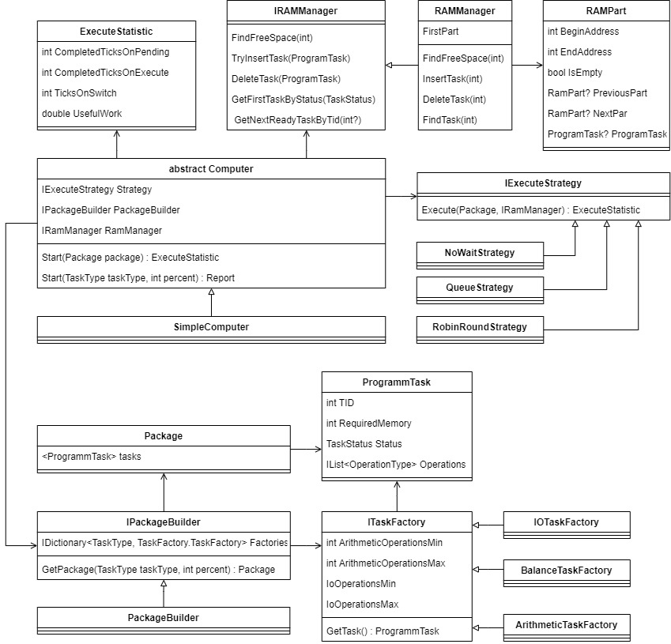
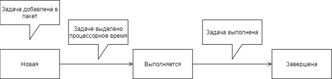
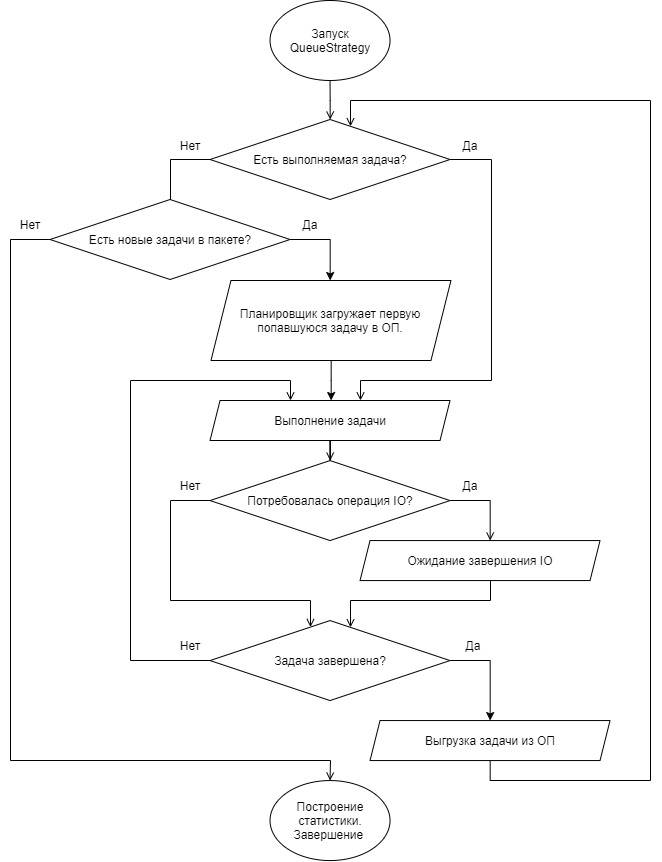
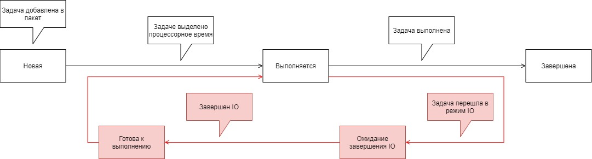
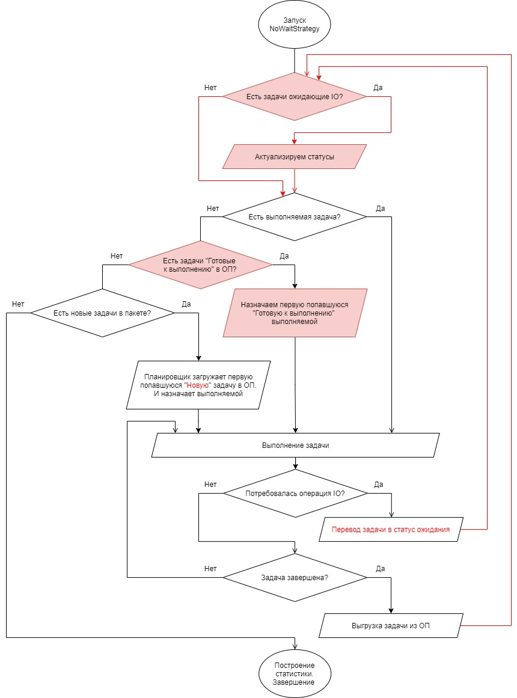
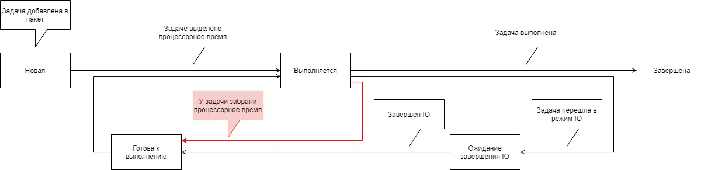
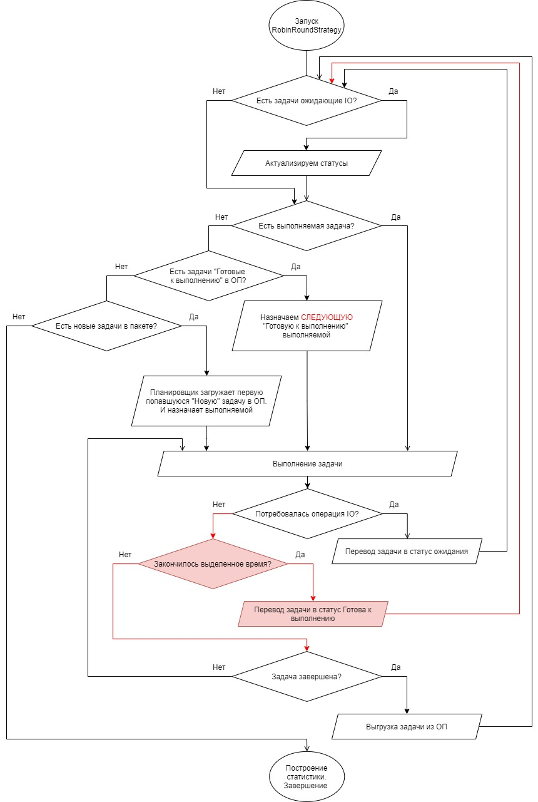

# Менеджер пакетной обаботки заданий в операционной системе

Программное обеспечение, моделирующее поведение операционной системы, выполняющей задания в пакетном режиме.
Предложено три стратегии обработки задач:
- Очередь – все задания выполняются строго по порядку
- Очередь, не ожидающая ввода-вывода – задания выполняются по порядку, но если требуется ввод-вывод, то происходит смена выполняемой задани
- RobinRound – каждой задаче выдается квант времени, который она может выполняться. Смена происходит в том случае, если нужен ввод-вывод или квант закончился.

## Подробности и результаты работы в [отчете](./info/POS_lab_1_lab_2_8PI-21_Potapov.pdf)

## Схема проекта

## Очередь
### Статусы задач

### Алгоритм

## Очередь без ожидания ввода-вывода
### Статусы задач

### Алгоритм

## RobinRound
### Статусы задач

### Алгоритм

